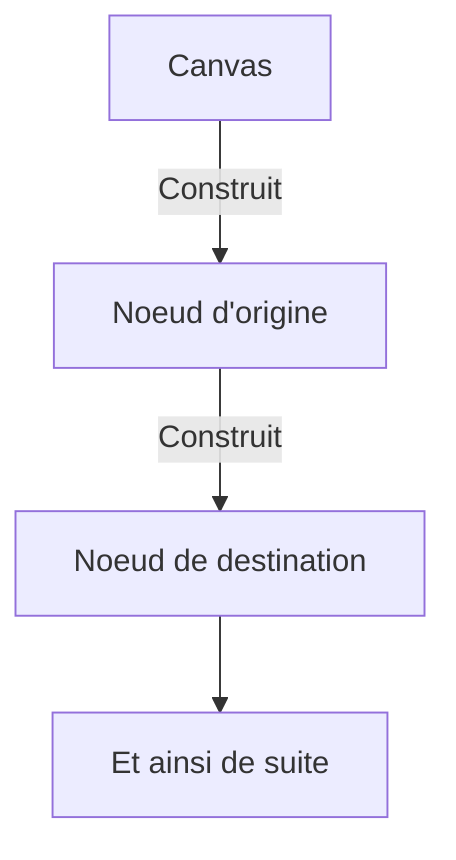

# Matinée

## Amélioration du système de création de nœuds



Il faudrait deux méthodes, une pour les nœuds d'origine et une pour les nœuds de destination.
Il est également possible de modifier l'algorithme en conséquence mais cela entraine trop de complexité dans le code.
L'usage d'un patron de conception serait une solution envisageable. Le constructeur peut être utilisé dans ce contexte. Le constructeur renverrait alors un JSX.Element et sa référence associée.
En effet, la création d'un nœud restera la même quelque soit le contexte, la seule chose qui change vient du traitement des enfants de ces nœuds. La référence est utilisée pour créer des liens et récupérer le Point correspondant ; cependant, si les nœuds enfants sont créés à partir du nœud parent, alors la référence n'est plus nécessaire.

Ainsi, en utilisant un constructeur, seule cette partie de l'algorithme serait généralisée :
```ts
futureNode = <TerminateCallNode
    canvas={this.canvasRef.current}
    onModifyData={callback => {
	    this.futureSerializations.push(callback); // cette partie peut poser problème
	    this.saveButtonRef.current.setDisable(false);
        destinationId={
            (await DestinationDAO.create(
            (await DestinationCategoryDAO.find(nodeType))[0].category_id,
            (await ModuleDAO.find(ModuleType.INBOUND_ROUTE))[0].module_id,
            1
        )).destination_id
    }
/>;
```

La partie `this.futureSerializations.push(callback);` peut être corrigée en intégrant le tableau dans les paramètres.

Voici par exemple, le constructeur de nœud d'annonce :
```ts
export class NodeBuilder {
	public async createAnnouncementNode(
			canvas: Canvas,
			onModifyCallback: (callback: () => Promise<void>) => Promise<void>): Promise<JSX.Element> {
		return <AnnouncementNode
			canvas={canvas}
			onModifyData={callback => onModifyCallback(callback)}
			destinationId={
				(await DestinationDAO.create(
				(await DestinationCategoryDAO.find(DestinationCategoryType.ANNOUNCEMENT))[0].category_id,
				(await ModuleDAO.find(ModuleType.INBOUND_ROUTE))[0].module_id,
				1
			)).destination_id
		} />;
	}
}
```

Du coté du Canvas, la partie concernant l'appel du Builder sera ainsi :

```ts
futureNode = await new NodeBuilder().createAnnouncementNode(
	this.canvasRef.current,
	async (callback) => {
		this.futureSerializations.push(callback);
		this.saveButtonRef.current.setDisable(false);
	});
```

Cette modification architecturale ne permet pas de gagner grandement en intelligibilité et en ce qui concerne la généricité, elle n'est pas non plus améliorée dans la mesure où le Canvas est le seul a pouvoir créer des nœuds.

Il est également possible de diviser l'algorithme en méthodes spécifiques comme celle-ci :

```ts
public async createTerminateCallNode() {
	let ref = React.createRef<TerminateCallNode>();
	
	this.canvasRef.current.addNode(<TerminateCallNode ref={ref}
		canvas={this.canvasRef.current}
		onModifyData={callback => {
			this.futureSerializations.push(callback);
			this.saveButtonRef.current.setDisable(false);
		}} destinationId={
			(await DestinationDAO.create(
				(await DestinationCategoryDAO.find(DestinationCategoryType.TERMINATE_CALL))[0].category_id,
				(await ModuleDAO.find(ModuleType.INBOUND_ROUTE))[0].module_id,
				1
			)).destination_id
		} />);
	return ref;
}
```

Le problème de ces méthodes, c'est que le code non spécifique devra être généralisé à la main lors de futures modifications éventuelles.

Une dernière solution serait d'intégrer le nécessaire dans le constructeur de sorte à pouvoir lui dédier la création de nœuds entièrement, cela donne :

```ts
export enum NodeType {
    ANNOUNCEMENT = "Annonce",
    TERMINATE_CALL = "Fin d'appel",
    QUEUE = "File d'attente",
    RING_GROUP = 'Groupe de sonnerie',
    IVR = 'IVR',
    TIME_CONDITION = 'Condition de temps',
    NIGHT_MODE = 'Mode nuit',
    EXTENSION = "Extension"
}

export class NodeBuilder {
    private onModifyCallback: (callback: () => Promise<void>) => Promise<void>;
    
    public constructor(onModifyCallback: (callback: () => Promise<void>) => Promise<void>) {
        this.onModifyCallback = onModifyCallback;
    }
    
    public async createNode(
        type: NodeType,
        canvas: Canvas,
        index = 1
    ) {
        switch (type) {
            case NodeType.ANNOUNCEMENT: return this.createAnnouncementNode(canvas, index)
        }
    }
    
    public async createAnnouncementNode(canvas: Canvas, index?: number) {
        let ref = React.createRef<AnnouncementNode>();
        
        canvas.addNode(<AnnouncementNode
            canvas={canvas}
            onModifyData={callback => this.onModifyCallback(callback)}
            destinationId={
                (await DestinationDAO.create(
                    (await DestinationCategoryDAO.find(
	                    DestinationCategoryType.ANNOUNCEMENT))[0].category_id,
                    (await ModuleDAO.find(ModuleType.INBOUND_ROUTE))[0].module_id,
                    index
                )).destination_id
            } />);
            
        // read entry with DAO and Index & for each point:
        // Create child node
        // Link child with this point
        
        return ref;
    }
}
```

Cette méthode améliore l'interopérabilité en évitant la redondance, et améliore également l'intelligibilité et la maintenabilité en séparant la partie création de la vue modèle.

# Après-midi

## Problème entre la création et la lecture lors de l'ajout de nœud

En effet, à l'heure actuelle j'avais divisé en deux parties la création de nœuds entièrement nouveaux et les nœuds chargés depuis des éléments existants.

La solution la plus simple serait d'utiliser le champ "index", si il est spécifié alors c'est qu'il faut lire une entrée, sinon il faut la créer.

### Expérience en condition réelle

Statut de l'expérience : ✅Concluante

J'ai créé un algorithme dans le constructeur permettant de générer les modes nuit ainsi que leurs destinations associées, voici le code source :

```ts
public async createNightModeNode(canvas: Canvas, index?: number) {
        let ref = React.createRef<NightModeNode>();
        
        // Create or read night mode
        let nightMode = index ? await NightModeDAO.read(index) : await 
		        NightModeDAO.read((await NightModeDAO.create({
            code: Util.generateRandomNumber(),
            description: Util.generateRandomString(),
            disabled_destination_id: (await DestinationDAO.create(24, 29, 1)).destination_id,
            enabled_destination_id: (await DestinationDAO.create(24, 29, 1)).destination_id,
        })).nightmode_id);
        
        // Add node
        await canvas.addNode(<NightModeNode
            ref={ref}
            canvas={canvas}
            onModifyData={callback => this.onModifyCallback(callback)}
            nightLodeId={nightMode.nightmode_id} />);
            
        // Create disabled destination
        let disabledDestination = await 
	        DestinationDAO.read(nightMode.disabled_destination_id);
        
        let disabledDestinationCategory = await 
	        DestinationCategoryDAO.read(disabledDestination.category_id);
        
        let disabledDestinationRef = await this.createNode(
            disabledDestinationCategory.name,
            canvas,
            disabledDestination.index
        );
        
        canvas.addLink(
            ref.current.getDisabledDestinationPoint(),
            disabledDestinationRef.current.getDestinationPoint()
        );
        
        // Create enabled destination
        let enabledDestination = await DestinationDAO.read(
	        nightMode.enabled_destination_id);
        let enabledDestinationCategory = await 
	        DestinationCategoryDAO.read(enabledDestination.category_id);
        
        let enabledDestinationRef = await this.createNode(
            enabledDestinationCategory.name,
            canvas,
            enabledDestination.index
        );
        
        await canvas.addLink(
            ref.current.getEnabledDestinationPoint(),
            enabledDestinationRef.current.getDestinationPoint()
        );
        
        return ref;
    }
```

Capture d'écran du résultat :

![[Pasted image 20230213151918.png]]

Comme on peut le voir ci-dessus, les nœuds ont étés créés et liés aux points du mode nuit.
Dans cet exemple, il s'agit de fin d'appel pour les destinations mais le système fonctionnera à terme avec tous les types de destination.

## Finalisation de la création des nœuds

Capture des nœuds créés dans la vue :

![[Pasted image 20230213161217.png]]

Il reste donc à ajouter les champs manquant et à compléter la liste des DAO.

## DAO et vues modèles manquants

Au vu de l'avancement global, il est intéressant de lister les éléments principaux manquants, en effet de nombreux DAO manquent à l'appel et cela empêche le traitement de certaines fonctionnalités importantes de ce prototype.

Certains nœuds manquent également, tel que les appareils qui sont utilisés par les extensions, cependant certains peuvent ne pas être prioritaire à l'heure actuelle. La question du temps gagné en fonction de l'adaptation requise entre une solution temporaire par rapport à la durée de développement de la fonctionnalité finale a sa place au moment de l'étude du dit manquement.

### DAO

- **IVR**: Particulièrement complexe en ce qu'il permet de multiplier les points d'origine.
	- **IVR entry** : Association entre un IVR et une destination.
	- **IVR option** : ?
- **Queue** : Modérément complexe dans la mesure où il est associé à des extensions, mais la DAO des extensions est terminée. Peut être liée à un IVR.
	- **Queue member** : Les extensions liés à un IVR
- **RingGroup** : Possède une liste d'extensions, doit donc être affiché en conséquence et de la même manière que pour la liste d'attente.
- **TimeCondition** : Très simple mais référence un time group.
- **InvalidTries** (facultatif) : Utilisé par ?
- **Strategy** (facultatif) : Utilisé par la file d'attente.

### Vues modèle & leur DAO associé

- **Recording** : Lié à plusieurs éléments, mais nécessite l'accès à des fichiers d'enregistrement. Sa configuration n'a peut être pas sa place dans cet éditeur.
- **Device** : Utilisé par les extensions, n'est pas particulièrement nécessaire pour le moment mais pourra l'être plus tard dans la mesure où il empêche de configurer de nouvelles extensions au démarrage.
- **ClassOfService** : Utilisé par plusieurs nœuds mais peut se remplacer par l'usage de l'indexe 1.
- **TimeGroup** (facultatif) : Utilisé par les time condition, utile dans la finalité mais pas urgent.
- **Conference** (facultatif) : Nœud important dans le contexte métier mais pas obligatoire dans ce prototype pour le moment.

> :luc_lightbulb: Il est intéressant de commencer par les DAO.

## DAO incomplets

- Inbound Route : Manque le CREATE et le DELETE.