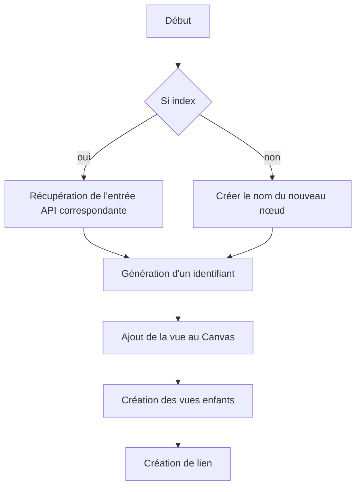

# Matinée

> Fatigue extrême malgré la bonne nuit, avancé et concentration difficiles : travailler davantage après repos

## Refactoring & Documentation

J'ai rajouté des fichiers de documentation pour expliciter un minimum mon code.
J'ai également segmenté le code source pour séparer la partie "UI" de la partie métier.

La classe Node Builder est beaucoup trop complexe, redondante et longue

# Après-midi

Les nouveautés en terme de design s'approchant de la version finale, les modifications inhérentes peuvent prétendre à un travail sur l'architecture. Un refactoring d'ampleur plus importante pourrait donc s'envisager si la demande n'est pas susceptible de changer du tout au tout bientôt.

### Le cas du Node Builder

```ts
switch (type) {
    case DestinationCategoryType.ANNOUNCEMENT:
        return this.createAnnouncementNode(canvas, position, index)
    case DestinationCategoryType.NIGHT_MODE:
        return this.createNightModeNode(canvas, position, index)
    case DestinationCategoryType.TERMINATE_CALL:
        return this.createTerminateCallNode(canvas, position, index)
    case DestinationCategoryType.QUEUE:
        return this.createQueueNode(canvas, position, index)
    case DestinationCategoryType.IVR:
        return this.createIVRNode(canvas, position, index)
    case DestinationCategoryType.RING_GROUP:
        return this.createRingGroupNode(canvas, position, index)
    case DestinationCategoryType.TIME_CONDITION:
        return this.createTimeConditionNode(canvas, position, index)
    case DestinationCategoryType.TIME_GROUP:
        return this.createTimeGroupNode(canvas, position, index)
    case DestinationCategoryType.EXTENSION:
        return this.createExtensionNode(canvas, position, index)
}
```

Le node builder permet tout simplement de générer les noeuds fonction du type passé.

```ts
public async createTimeGroupNode(canvas: Canvas, position: { x: number, y: number }, index ?: number) {
    let ref = React.createRef<TimeGroupNode>()
    let newId = "" + ((await TimeGroupDAO.readAll()).length + 1)

    let extensionId = (await ExtensionDAO.readAll()).length !== 0 ? (await ExtensionDAO.readAll()).pop()?.extension_id
        : (await ExtensionDAO.create({
            extension: Randomizer.generateRandomNumber(),
            name: Randomizer.generateRandomString()
        })).extension_id

    let timeGroup = index ? TimeGroupDAO.read(index) : TimeGroupDAO.read((await TimeGroupDAO.create(
        "Groupe temporel n°" + newId,
        extensionId
    )).time_group_id)

    let identifier = Randomizer.generateRandomIdentifier()

    await canvas.addNode(identifier, <TimeGroupNode
        identifier={identifier}
        ref={ref}
        canvas={canvas}
        key={identifier}
        onModifyCallback={async () => {
            if (this.onModifyCallback) await this.onModifyCallback()
        }}
        timeGroupId={(await timeGroup).time_group_id}
    />)

    this.lastColumnHeight = this.columnHeight
    this.columnHeight = 0

    if (position) await ref.current.getNode().getWindow().setPosition(position.x, position.y)

    let extensionRef = await this.createExtensionNode(
        canvas,
        this.calculatePosition(canvas, ref.current.getExtensionOriginPoint()),
        extensionId
    )

    this.linkAside(
        canvas,
        ref.current.getExtensionOriginPoint(),
        extensionRef.current.getDestinationPoint()
    )

    this.columnHeight = this.lastColumnHeight + ref.current.getNode().getWindow().rootRef.current.clientHeight + 20

    return ref
}
```

Ensuite les méthodes relatives à chaque nœud permettent de retourner la vue correspondante et générer ses enfants, on peut exprimer l'algorithme à travers les étapes suivantes :
1. Créer le nom du nouveau nœud
2. Création des entrées API nécessaires
3. Génération d'un identifiant
4. Ajout de la vue au Canvas
5. Réinitialisation de la taille de la colonne
6. Repositionnement de la vue
7. Création des vues enfants (récursivité)
8. Création du/des lien(s)
9. Ajout de la taille du nœud à la taille de la colonne

On peut simplifier :
- En séparant le cas ou il faut créer et celui ou il faut récupérer

Création :
1. Créer le nom du nouveau nœud
2. Créer l'entrée API
3. etc...

Récupération
1. Récupération de l'entrée API correspondante
2. etc...

L'ajout de la vue au Canvas se fait dans tous les cas.

**Le positionnement ne dépends pas du noeud**, il devrait se faire dans le DialPlan.

Donc on obtient :


Je peux retirer la création de l'identifiant pour le faire avant et le généraliser à toutes les fabriques.

```ts
export class AnnouncementNodeBuilder {
    public static async build(
	    builder: NodeBuilder,
	    canvas: Canvas,
	    identifier: string,
	    column: number,
	    index?: number
	) {
        let apiEntry = await this.getApiEntry(index)
        let ref = await this.createView(canvas, identifier, builder, apiEntry)
        await this.createDestinations(apiEntry, canvas, builder, ref, column)
        return ref
    }
	
    private static async getApiEntry(index: number) {
        let announcement;
		
        if (index) {
            announcement = await AnnouncementDAO.read(index)
        } else {
            console.log("Je créé une annonce")
            announcement = await AnnouncementDAO.read((await AnnouncementDAO.create(
                "Annonce n°" + ((await AnnouncementDAO.readAll()).length + 1),
                1,
                (await DestinationDAO.create(
                    (await DestinationCategoryDAO.find(DestinationCategoryType.TERMINATE_CALL))[0].category_id,
                    (await ModuleDAO.find(ModuleType.INBOUND_ROUTE))[0].module_id,
                    1
                )).destination_id,
            )).announcement_id)
        }
		
        return announcement
    }
	
    private static async createView(
	    canvas: Canvas,
		identifier: string,
		builder: NodeBuilder,
		apiEntry: any
	) {
        let ref = React.createRef<AnnouncementNode>()
		
        await canvas.addNode(identifier, <AnnouncementNode
            identifier={identifier}
            ref={ref}
            canvas={canvas}
            key={identifier}
            onModifyCallback={builder.onModifyCallback}
            announcementId={apiEntry.announcement_id} />
        )
		
        return ref
    }
	
    public static async createDestinations(
		apiEntry: any, 
		canvas: Canvas, 
		builder: NodeBuilder, 
		ref: React.RefObject<any>, 
		column: number
	) {
        let destination = await DestinationDAO.read(apiEntry.destination_id)
        let destinationCategory = await DestinationCategoryDAO.read(destination.category_id)
		
        if (destinationCategory.name !== DestinationCategoryType.TERMINATE_CALL) {
            let destinationRef = await builder.createDestinationNode(
                destinationCategory.name,
                canvas,
                column++,
                destination.index,
            )
			
            await builder.linkAside(
                canvas,
                ref.current.getOriginPoint(),
                destinationRef.current.getDestinationPoint()
            )
        }
    }
}
```

Je peux rendre abstrait certaines méthodes et avoir une classe abstraite :

```ts
export abstract class SpecialNodeBuilder<T> {
    public async build(
	    builder: NodeBuilder,
		 canvas: Canvas, 
		 identifier: string, 
		 column: number, 
		 index?: number
	) {
        let apiEntry = await this.getApiEntry(index)
        let ref = await this.createView(canvas, identifier, builder, apiEntry)
        await this.createDestinations(apiEntry, canvas, builder, ref, column)
        return ref
    }
	
    protected abstract getApiEntry(index: number): Promise<any>
	
    protected abstract createView(
        canvas: Canvas,
        identifier: string,
        builder: NodeBuilder,
        apiEntry: any
    ): Promise<React.RefObject<T>>
	
    protected abstract createDestinations(
        apiEntry: any,
        canvas: Canvas,
        builder: NodeBuilder,
        ref: React.RefObject<any>,
        column: number
    ): Promise<void>
}
```

Et n'avoir que celà dans la classe spécialisée :

```js
export class AnnouncementNodeBuilder extends SpecialNodeBuilder<AnnouncementNode> {
    protected async getApiEntry(index: number): Promise<any> {
        let announcement;
		
        if (index) {
            announcement = await AnnouncementDAO.read(index)
        } else {
            console.log("Je créé une annonce")
            announcement = await AnnouncementDAO.read((await AnnouncementDAO.create(
                "Annonce n°" + ((await AnnouncementDAO.readAll()).length + 1),
                1,
                (await DestinationDAO.create(
                    (await DestinationCategoryDAO.find(DestinationCategoryType.TERMINATE_CALL))[0].category_id,
                    (await ModuleDAO.find(ModuleType.INBOUND_ROUTE))[0].module_id,
                    1
                )).destination_id,
            )).announcement_id)
        }
		
        return announcement
    }
	
    protected async createView(
        canvas: Canvas,
        identifier: string,
        builder: NodeBuilder,
        apiEntry: any
    ): Promise<React.RefObject<AnnouncementNode>> {
        let ref = React.createRef<AnnouncementNode>()
		
        await canvas.addNode(identifier, <AnnouncementNode
            identifier={identifier}
            ref={ref}
            canvas={canvas}
            key={identifier}
            onModifyCallback={builder.onModifyCallback}
            announcementId={apiEntry.announcement_id} />
        )
		
        return ref
    }
	
    protected async createDestinations(
        apiEntry: any, 
        canvas: Canvas, 
        builder: NodeBuilder, 
        ref: React.RefObject<any>, 
        column: number
    ): Promise<void> {
        let destination = await DestinationDAO.read(apiEntry.destination_id)
        let destinationCategory = await DestinationCategoryDAO.read(destination.category_id)
		
        if (destinationCategory.name !== DestinationCategoryType.TERMINATE_CALL) {
            let destinationRef = await builder.createDestinationNode(
                destinationCategory.name,
                canvas,
                column++,
                destination.index,
            )
			
            await builder.linkAside(
                canvas,
                ref.current.getOriginPoint(),
                destinationRef.current.getDestinationPoint()
            )
        }
    }
}
```

J'ai fini d'implémenter celà aec les noeuds TImeCondition, ringgroup et 