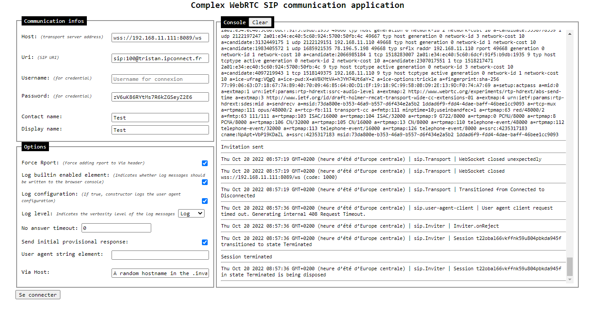

# Huitième jour

## User Agent

Etant donné que je n'ai pas réussi à rêgler mon problème, j'ai décidé de prendre en main davantage la librairie en faisant une autre page html avec la version complexe de la librairie, à savoir les User Agent.

J'ai créé une page relativement complête qui sera un bon point de départ pour des applicatrions futures. Même si, certains réagustements seraient de rigueur au niveau architectural.

