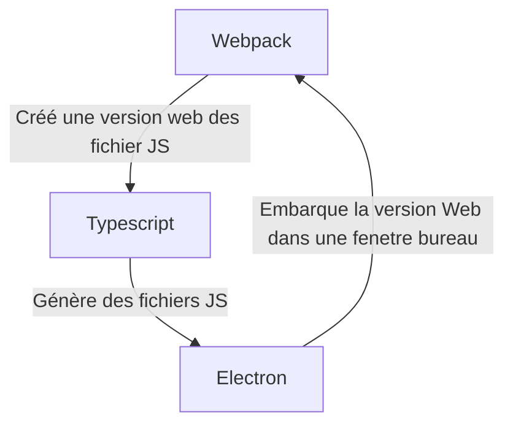

# Jeudi 3 novembre

Je dois faire une version DEFINITIVE de mes maquettes et les envoyé à direction@ipconnect.fr avec :
- La liste des fonctionnalités majeures et mineures (en use-case).
- Un affichage par vue.
- Des explications des fonctionnalité détaillées sur chaque vue.

J'ai terminé la maquette ainsi que les diagrammes use-case. J'attends donc la validation de la part de la direction.

Cette après-midi j'ai attaqué l'architecture en attendant la validation, j'ai utilisé le site refactoring.guru pour sélectionner des design pattern a utiliser popur chaque fonctionnalité clé.

J'ai également initialisé mon projet en utilisant Typescript, Webpack et Electron. Les trois se complête parfaitement, typescript commence par compiler en javascript, webpack créé une version "web friendly" à partir des fichiers Javascript et Eletron créé une fenètre bureautique dans laquelle il charge l'application web générée par webpack.

